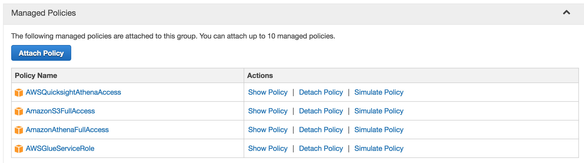

# aws-s3-athena
Example scripts for working with AWS S3 and Athena

## Usage

### Install requirements

```bash
pip install -r requirements.txt
```

### Update .config.yml

```yaml
AWS_ACCESS: AWS_ACCESS_KEY
AWS_SECRET: AWS_SECRET_KEY
BUCKET_NAME: NAME_THE_BUCKET_UNIQUELY
```

### Ensure provided keys have sufficient permissions



### Create bucket and upload data to S3

```bash
python setup.py
```

### Run queries, results will be in S3

```bash
python query_csv.py
```

### Remove files loaded into S3 and delete bucket

```bash
python teardown.py
``` 

## Notes

- Athena does not support multiple file types within a directory
- multi-line JSON files not supported
- AWS Glue has schema automatic exploration feature to help with table definitions (https://aws.amazon.com/glue/details/)
- Query results are on S3 but may be delayed in execution

## References

- Generating Mock Data - Mockaroo
  - https://www.mockaroo.com/
- Boto3 Documentation
  - http://boto3.readthedocs.io/en/latest/guide/quickstart.html#configuration 
- AWS Big Data Blog: Analyzing Data in S3 using Amazon Athena 
  - https://aws.amazon.com/blogs/big-data/analyzing-data-in-s3-using-amazon-athena/
- Medium Article: Automating AWS Athena batch jobs with Python 3
  - https://medium.com/@devopsglobaleli/introduction-17b4d0c592b6

## Potential Updates

- Break up scripts with multiple keys to for adherence to least privilege principle
- Build Nested JSON example [[AWS Blogpost]](https://aws.amazon.com/blogs/big-data/create-tables-in-amazon-athena-from-nested-json-and-mappings-using-jsonserde/)
- Build Regex Example [[Docs]](https://docs.aws.amazon.com/athena/latest/ug/apache.html)